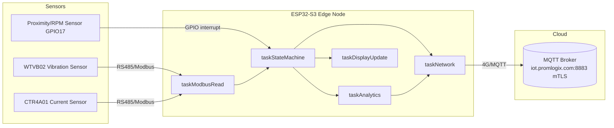
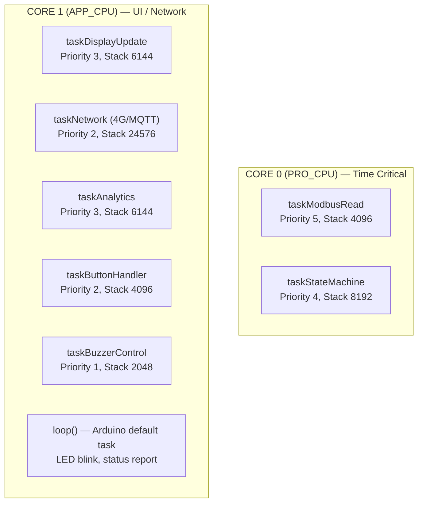
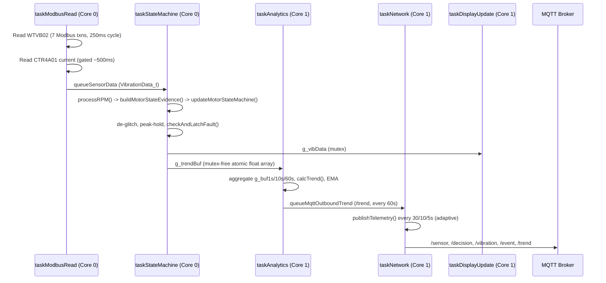

# Firmware Architecture — WTVB02_ESP32S3_V16_CM_fault_latch_v3_hardened_patched_v16_5

**Source file:** `WTVB02_ESP32S3_V16_CM_fault_latch_v3_hardened_patched_v16_5.ino` (7,666 lines, single-file Arduino sketch)
**Verification basis:** every claim below is either (a) a direct source-code citation with a line number, or (b) a literal value observed in a live Serial Monitor capture during this documentation effort (marked *"observed"*), never inferred.

**Related documents:** [MOTOR_STATE.md](MOTOR_STATE.md) · [TELEMETRY.md](TELEMETRY.md) · [FIRMWARE_CONFIG_AUDIT_v16.5.md](FIRMWARE_CONFIG_AUDIT_v16.5.md)

## Table of Contents

- [System Overview](#system-overview)
- [Hardware](#hardware)
- [ESP32-S3 Dual-Core Architecture](#esp32-s3-dual-core-architecture)
- [FreeRTOS Task Layout](#freertos-task-layout)
- [Core 0 Responsibilities](#core-0-responsibilities)
- [Core 1 Responsibilities](#core-1-responsibilities)
- [Synchronization Primitives](#synchronization-primitives)
- [Data Flow](#data-flow)
- [Sensor Acquisition](#sensor-acquisition)
- [Current Measurement](#current-measurement)
- [RPM Calculation](#rpm-calculation)
- [Motor State Machine](#motor-state-machine)
- [Analytics](#analytics)
- [MQTT Pipeline](#mqtt-pipeline)
- [Telemetry Generation](#telemetry-generation)
- [Memory Overview](#memory-overview)
- [Boot Sequence](#boot-sequence)
- [Main Execution Flow (`loop()`)](#main-execution-flow-loop)

---

## System Overview

This firmware runs a condition-monitoring edge node: it reads vibration (WTVB02) and current (CTR4A01) sensors over a shared RS485/Modbus RTU bus, derives a motor run-state and vibration health assessment, and publishes the result over 4G/MQTT (mTLS) to a broker, with a local OLED UI and buzzer/LED alarm indication. All application logic runs across 7 FreeRTOS tasks split over the ESP32-S3's two cores, plus the default Arduino `loop()` task.

[⬆ Back to top](#table-of-contents)

## Hardware

Verified from `WTVB02_ESP32S3_V16_CM_fault_latch_v3_hardened_patched_v16_5.ino` pin/config `#define` block (lines 100-179) and the [firmware config audit](FIRMWARE_CONFIG_AUDIT_v16.5.md):

| Component | Detail | Source |
|---|---|---|
| MCU | ESP32-S3 (QFN56, revision v0.2), dual core + LP core, 240 MHz | *observed* via `esptool` chip identification during this session |
| PSRAM | 8 MB embedded | *observed* via `esptool` (`Embedded PSRAM 8MB (AP_3v3)`); build flag `PSRAM=opi` |
| Flash | 16 MB | *observed* boot banner: `Flash Size: 16 MB`; build `FlashSize=16M`, `PartitionScheme=app3M_fat9M_16MB` |
| Board | LilyGO T-Vending S3 | source comment, line 103 |
| Cellular modem | SIMCom A7670 (TinyGSM `TINY_GSM_MODEM_SIM7600` profile) | line 78, 117 |
| Vibration sensor | WTVB02, Modbus RTU slave `0x50` @ 9600 baud | `MODBUS_SLAVE_ID` (line 133), `MODBUS_BAUDRATE` (line 132) |
| Current sensor | CTR4A01, Modbus RTU slave `0x01`, shares the same RS485 bus | `CURRENT_SENSOR_ID` (line 137) |
| RPM/proximity sensor | GPIO17, PC817 or NPN opto input | `PIN_RPM` (line 193) |
| Display | SSD1306-class OLED via `U8G2_SSD1306_128X64_NONAME_F_HW_I2C`, I2C SDA=GPIO44/SCL=GPIO43 | line 1087, `I2C_SDA_PIN`/`I2C_SCL_PIN` (lines 114-115) |
| RS485 bus | RX=GPIO38, TX=GPIO39, driver-enable=GPIO42 — shared by WTVB02 and CTR4A01 | `RS485_RX_PIN`/`RS485_TX_PIN`/`RS485_EN_PIN` (lines 109-111) |
| Modem UART | TX=GPIO3, RX=GPIO46, PWRKEY=GPIO4, RESET=GPIO9 | lines 118-121 |
| Buttons | SELECT=GPIO5, ENTER=GPIO6 | `PIN_BUTTON`/`PIN_BUTTON_ENTER` (lines 104-105) |
| Buzzer | GPIO7 | `PIN_BUZZER` (line 106) |
| Status LEDs | Onboard=GPIO10, Cloud=GPIO15 | `BUILTIN_LED`/`PIN_LED_CLOUD` (lines 123-124) |

**Note:** `OLED_WIDTH`/`OLED_HEIGHT`/`OLED_ADDRESS` (lines 127-129) are defined but confirmed **unused** — the U8G2 display object's dimensions are hardcoded into its class-name template argument (`128X64`) instead. See [FIRMWARE_CONFIG_AUDIT_v16.5.md § Unused Constants](FIRMWARE_CONFIG_AUDIT_v16.5.md#appendix-unused-constants-13-confirmed-zero-other-references).

[⬆ Back to top](#table-of-contents)

## ESP32-S3 Dual-Core Architecture

The sketch explicitly pins every FreeRTOS task to a specific core via `xTaskCreatePinnedToCore(..., core)` (lines 7355-7435). The split follows a clean rule stated in the source's own banner comments (lines 7353, 7380): **Core 0 = time-critical, Core 1 = user interface / network**.

[⬆ Back to top](#table-of-contents)

## FreeRTOS Task Layout

Verified directly from the `xTaskCreatePinnedToCore()` calls, lines 7355-7435:

| Task function | FreeRTOS name | Priority | Stack (bytes) | Core | Priority `#define` | Stack `#define` |
|---|---|---|---|---|---|---|
| `taskModbusRead` | `"ModbusRead"` | 5 | 4096 | 0 | `PRIORITY_MODBUS` | `STACK_SIZE_MODBUS` |
| `taskStateMachine` | `"StateMachine"` | 4 | 8192 | 0 | `PRIORITY_STATE` | `STACK_SIZE_STATE` |
| `taskDisplayUpdate` | `"DisplayUpdate"` | 3 | 6144 | 1 | `PRIORITY_DISPLAY` | `STACK_SIZE_DISPLAY` |
| `taskNetwork` | `"Network4G"` | 2 | 24576 | 1 | `PRIORITY_NETWORK` | `STACK_SIZE_NETWORK` |
| `taskAnalytics` | `"Analytics"` | 3 | 6144 | 1 | `PRIORITY_ANALYTICS` | `STACK_SIZE_ANALYTICS` |
| `taskButtonHandler` | `"ButtonHandler"` | 2 | 4096 | 1 | `PRIORITY_BUTTON` | `STACK_SIZE_BUTTON` |
| `taskBuzzerControl` | `"BuzzerControl"` | 1 | 2048 | 1 | `PRIORITY_BUZZER` | *(literal `2048`, not a named `#define` — verified: no `STACK_SIZE_BUZZER` constant exists in the source)* |

`taskModbusRead` (priority 5) is the highest-priority task in the system — it owns the shared RS485 bus and runs on a fixed 250ms cadence, so nothing may block it for long. `taskStateMachine` (priority 4, Core 0) is the only other Core-0 task, ensuring the motor-state decision is never preempted by UI/network work.

[⬆ Back to top](#table-of-contents)

## Core 0 Responsibilities

**`taskModbusRead`** (`WTVB02_ESP32S3_V16_CM_fault_latch_v3_hardened_patched_v16_5.ino:3719`) — runs every 250ms (`xFrequency = pdMS_TO_TICKS(250)`, line 3708 context). Each cycle performs up to 7 Modbus RTU transactions over the shared RS485 bus: WTVB02 velocity/temperature/frequency/crest-factor/kurtosis/peak registers, plus a gated CTR4A01 current read every ~500ms (`CURRENT_SAMPLE_INTERVAL_MS`, line 3829 gate check). Results are packed into a `VibrationData_t` and pushed onto `queueSensorData`.

**`taskStateMachine`** (line 4191) — consumes `queueSensorData`, calls `processRPM()` (line 2830) which runs the RPM EMA filter and the Motor State Machine (`buildMotorStateEvidence()` + `updateMotorStateMachine()`), applies VRMS de-glitch/spike filtering, updates `g_velPeakHold`, appends to `g_trendBuf`, and calls `checkAndLatchFault()` for the alarm-latch pipeline. Writes the shared `g_vibData` snapshot (mutex-guarded) that Core 1 tasks read.

[⬆ Back to top](#table-of-contents)

## Core 1 Responsibilities

| Task | Role |
|---|---|
| `taskDisplayUpdate` (line 4529) | Renders the OLED screens (machine status, warning, critical, axis detail, network) from the `g_vibData` snapshot. |
| `taskNetwork` (line 4600) | Owns the SIMCom A7670 modem, GPRS/MQTT connection lifecycle, NTP time sync, and is the **sole task that calls `mqttClient.publish()`** for `/sensor`, `/decision`, `/vibration`, `/event`, plus drains the `/trend` outbound queue and replays the offline telemetry ring buffer. See [TELEMETRY.md](TELEMETRY.md). |
| `taskAnalytics` (line 6474) | 1Hz cadence. Aggregates `g_trendBuf` into the multi-resolution `g_buf1s`/`g_buf10s`/`g_buf60s` ring buffers, computes EMA/slope/spike-count trend statistics, and every 60th tick builds and enqueues the `/trend` payload via `enqueueMqttOutbound()` (does not publish directly — see [MQTT Pipeline](#mqtt-pipeline)). |
| `taskButtonHandler` (line 5178) | SELECT/ENTER button debounce and page navigation / alarm acknowledge. |
| `taskBuzzerControl` (line 5413) | Drives the buzzer per `g_systemState.buzzerActive`. |
| `loop()` (line 7482, Arduino default task) | Onboard LED heartbeat blink, Cloud LED (GPIO15) status blink, periodic full-system STATUS REPORT print, watchdog feed. |

[⬆ Back to top](#table-of-contents)

## Synchronization Primitives

7 mutexes are created at boot (lines 7291-7297), all `xSemaphoreCreateMutex()`:

| Mutex | Guards |
|---|---|
| `mutexVibData` | `g_vibData` (the shared latest-sensor-snapshot struct) |
| `mutexSystemState` | `g_systemState` (alarm state, MQTT/GPRS connection cache) |
| `mutexI2C` | RTC + OLED I2C bus access (`RTC_NOW_SAFE` macro, line 1432) |
| `mutexModem` | Modem/GPRS/MQTT client access |
| `mutexAggBufs` | `g_buf1s`/`g_buf10s`/`g_buf60s` aggregation buffers (Phase 2) |
| `mutexFaultLatch` | `g_fl`/`g_flCount` + the `fault_latch` NVS namespace |
| `mutexTelemBuf` | The offline telemetry ring buffer |

Queues (created lines 7309-7338): `queueSensorData` (depth 5, Modbus→State), `queueButtonEvent` (3), `queueDisplayUpdate` (3), `queueMaintEvent` (2, Button→Network audit), `queueMqttOutboundTrend` (6, Analytics→Network for `/trend`), and `queueDiagSnapshot` (1, only when `VERIFY_TEST` is defined — disabled by default).

Per project convention (see `CLAUDE.md`), cross-core communication for anything larger than a single float/enum word goes through a mutex or queue — never a bare shared boolean.

[⬆ Back to top](#table-of-contents)

## Data Flow

[⬆ Back to top](#table-of-contents)

## Sensor Acquisition

`taskModbusRead()` (line 3719) addresses the WTVB02 (slave `0x50`) for velocity RMS (X/Y/Z), temperature, frequency, crest factor, kurtosis, and peak-velocity registers — full register map documented in [FIRMWARE_CONFIG_AUDIT_v16.5.md § Modbus](FIRMWARE_CONFIG_AUDIT_v16.5.md#modbus-27-items). A stuck-sensor watchdog (`STUCK_THRESHOLD`, `STUCK_MIN_RAW`) detects and auto-restarts the sensor per axis (Vx/Vy/Vz stuck detection, lines 2966-2986 region). Each cycle assembles a `VibrationData_t` struct and pushes it to `queueSensorData` (non-blocking, drops with a `[CORE 0] Sensor queue full!` log on overflow, line 4134).

[⬆ Back to top](#table-of-contents)

## Current Measurement

`readCTR4A01Current()` (line 3699) addresses the CTR4A01 (slave `0x01`) on the same RS485 bus, gated to a ~500ms cadence (`CURRENT_SAMPLE_INTERVAL_MS`, line 3829). The raw milliamp reading is converted to Amps and EMA-filtered (`CURRENT_EMA_ALPHA`) inside `buildMotorStateEvidence()`'s `MOTOR_SRC_CURRENT` branch — see [MOTOR_STATE.md](MOTOR_STATE.md) for the full evidence-to-state pipeline. `current_read_errors`/`current_buf_count` are exposed in the `/vibration` payload for remote diagnosis of CT read failures.

[⬆ Back to top](#table-of-contents)

## RPM Calculation

RPM is derived from GPIO17 proximity-sensor pulses captured via ISR (`g_rpmPulseInterval`, `g_rpmTotalPulses`, IRAM-resident, lines 2041-2140 region), and EMA-smoothed inside `processRPM()` (line 2830) using `RPM_SMOOTH_ALPHA`. Spike rejection (`SPIKE_REJECT_FACTOR` × `MAX_RPM`) discards implausible pulse-derived RPM values before they enter the filter. Full detail in [MOTOR_STATE.md](MOTOR_STATE.md).

[⬆ Back to top](#table-of-contents)

## Motor State Machine

Summarized here; the complete state-by-state, constant-by-constant reference — including the confirmed root cause of the July 2026 STARTING/STOPPING flicker — lives in **[MOTOR_STATE.md](MOTOR_STATE.md)**.

In one sentence: `buildMotorStateEvidence()` (line 2721) translates either RPM-in-band or CTR4A01-current-above-threshold into a semantic `{signalPresent, ageMs}` pair (selected at compile time by `g_motorStateSource`, itself set by whether `-DTEST_CURRENT_SOURCE` was passed to the compiler), and `updateMotorStateMachine()` (line 2790) turns that evidence into one of `MOTOR_STOPPED` / `MOTOR_STARTING` / `MOTOR_RUNNING` / `MOTOR_STOPPING`, which every downstream consumer (analytics gating, alarm evaluation, telemetry field gating, display) reads from `data->motor_state`.

[⬆ Back to top](#table-of-contents)

## Analytics

`taskAnalytics()` (line 6474, Core 1, 1Hz) maintains three cascaded ring buffers — `g_buf1s`/`g_buf10s`/`g_buf60s` (60 slots each, `AGG_BUF_1S_SIZE`/`AGG_BUF_10S_SIZE`/`AGG_BUF_60S_SIZE`) — built from `g_trendBuf` snapshots. Slot width for `buf1s` is RPM-adaptive (`computeSlotDurMs()`, line 6464, Patent Claim 2: targets `SLOT_REVS_TARGET` shaft revolutions per slot, clamped to `[SLOT_DUR_MIN_MS, SLOT_DUR_MAX_MS]`). `calcTrend()` (line 5798) computes linear-regression slopes at 1s/10s/60s windows, spike counts, and frequency drift. An EMA of RMS (`EMA_ALPHA`) tracks slow drift direction (`g_emaDir`). Every 60th analytics tick (`analyticsPublishCnt`, line 6842-6844), the `/trend` JSON is built and handed to `enqueueMqttOutbound()` for `taskNetwork` to actually publish.

[⬆ Back to top](#table-of-contents)

## MQTT Pipeline

Full topic-by-topic JSON schema documentation lives in **[TELEMETRY.md](TELEMETRY.md)**. Architecturally, there are two distinct publish patterns in this firmware:

1. **Synchronous, in-task publish** — `/sensor`, `/decision`, `/vibration` (all three built and published back-to-back inside `publishTelemetry()`, line 6008, called from `taskNetwork`), plus `/event` (maintenance audit) and the fault-latch `/decision` variant — all call `mqttClient.publish()` directly from `taskNetwork`.
2. **Producer/consumer queue publish** — `/trend` is *built* by `taskAnalytics` (Core 1) but *enqueued* via `enqueueMqttOutbound()` (line 2530) onto `queueMqttOutboundTrend`, and only actually published by `taskNetwork` draining that queue (line 4908-4923). This is the only cross-task-producer MQTT path in the firmware; every other topic is published by the same task (`taskNetwork`) that owns the `mqttClient` object.

When MQTT is disconnected at publish time, telemetry is not dropped: `pushTelemBuf()` (line 2303) stores it in a 120-slot RAM ring buffer (`TELEM_BUF_SIZE`), which `replayTelemBuf()` (line 2369) drains at 1 slot per `taskNetwork` loop iteration (~75ms spacing) once MQTT reconnects.

[⬆ Back to top](#table-of-contents)

## Telemetry Generation

`publishTelemetry()` (line 6008) is the central telemetry function: given the latest `VibrationData_t` and alarm `MachineState_t`, it computes health score, gates all RUNNING-only fields (RMS/peak/CF/kurtosis/frequency-ratio) to zero outside `MOTOR_RUNNING`, calls `calcTrend()`, and serializes three JSON payloads (`/sensor`, `/decision`, `/vibration`) back to back. Publish cadence is adaptive to alarm severity: 30s (NORMAL) / 10s (WARNING) / 5s (CRITICAL) — see [TELEMETRY.md](TELEMETRY.md) for the full schema of every field.

[⬆ Back to top](#table-of-contents)

## Memory Overview

Figures below are *observed* directly from a live Serial Monitor capture during this documentation effort (not simulated or inferred):

| Metric | Observed value |
|---|---|
| CPU Frequency | 240 MHz |
| Flash Size | 16 MB |
| Free Heap (fresh boot, before modem init) | 300,096 bytes |
| Free Heap (60s uptime, modem+MQTT connected) | 224,576 bytes |
| Min Free Heap (60s uptime) | 224,264 bytes |

Task stack high-water marks (bytes *remaining*, i.e. unused headroom) observed at ~60s uptime:

| Task | Stack remaining (bytes) | Configured stack size |
|---|---|---|
| Modbus | 1,988 | 4096 |
| State | 7,068 | 8192 |
| Display | 3,960 | 6144 |
| Network | 21,240 | 24576 |
| Analytics | 2,180 | 6144 |
| Button | 3,244 | 4096 |
| Buzzer | 1,160 | 2048 |

The Modbus task (4096 configured, 1988 remaining ⇒ ~2108 bytes / ~51% used at the observed moment) and Analytics task (6144 configured, 2180 remaining ⇒ ~3964 bytes / ~65% used) run with the least headroom of the seven tasks — consistent with `STACK_SIZE_STATE`'s own in-source comment (line 393) recording a prior near-overflow (`watermark was 172B=92% used`) that motivated raising it from 6144 to 8192.

[⬆ Back to top](#table-of-contents)

## Boot Sequence

Verified by cross-referencing `setup()` (line 7068 onward) against its own `Serial.println("[Init] ...")` markers and a live boot capture:

1. `Serial.begin(115200)` + 1s settle delay (line 7056-7057)
2. `loadNvsConfig()` (line 7060) — loads Config-Mode identity overrides (`CFG_NS` namespace) if previously saved
3. **Config Mode prompt** — 5-second countdown; pressing Enter within the window enters `runConfigMode()` (interactive serial config, ends in `ESP.restart()`); otherwise falls through to normal boot (`"[CONFIG] Boot normal"`)
4. Task Watchdog reconfigured to 30s timeout on both cores (line 7089-7096) — the Arduino-core default of 5s is too short for 4G modem operations
5. Version banner + CPU/Flash/Heap info printed
6. **Motor-state build-identity banner** (`[Commit 4C]`, lines 7108-7132) — prints `TEST_CURRENT_SOURCE`, `g_motorStateSource`, and the four key Motor State timing/threshold constants, added specifically so firmware identity is verifiable from the Serial Monitor alone (see [MOTOR_STATE.md § Troubleshooting](MOTOR_STATE.md#troubleshooting-the-july-2026-startingstopping-flicker))
7. MQTT topic strings built (`snprintf` into `g_mqttTopic*`, lines 7112-7128) from `PLANT_ID`/`MACHINE_ID`
8. GPIO configured (buttons, buzzer, RS485 enable, LEDs)
9. OLED initialized
10. RTC checked (power-loss detection, compile-time fallback if invalid)
11. WTVB02 sensor configured over Modbus (`reconfigSensorAfterRestart()`: unlock → MODE=FreqDomain → unlock → SR=1kHz → unlock → Save; **DRM is deliberately never written**, per the source's own comment — see the config audit's Unused Constants appendix)
12. 7 mutexes created (line 7291-7297)
13. Queues created (`queueSensorData`, `queueButtonEvent`, `queueDisplayUpdate`, `queueMaintEvent`; then the dormant `queueMqttOutboundTrend`; then `queueDiagSnapshot` if `VERIFY_TEST`)
14. 2-second delay (line 7344)
15. 7 FreeRTOS tasks created, pinned per the [task layout table](#freertos-task-layout) above
16. `setup()` returns; the Arduino runtime begins calling `loop()` repeatedly on its own default task

[⬆ Back to top](#table-of-contents)

## Main Execution Flow (`loop()`)

`loop()` (line 7482) is intentionally lightweight — all real work happens in the 7 pinned tasks above. Verified responsibilities:
- Onboard LED (`BUILTIN_LED`) heartbeat blink, 1s toggle period
- Cloud LED (`PIN_LED_CLOUD`, GPIO15) status blink reflecting 4G/MQTT connection state (off=no signal, slow blink=connecting, fast blink=GPRS-up-MQTT-down, solid=MQTT connected)
- Periodic full-system STATUS REPORT print (the block used to populate the [Memory Overview](#memory-overview) table above)
- Watchdog feed for the loop task itself

[⬆ Back to top](#table-of-contents)

---

*This document describes firmware behavior as of the source state at documentation time. No source code was modified to produce it.*
