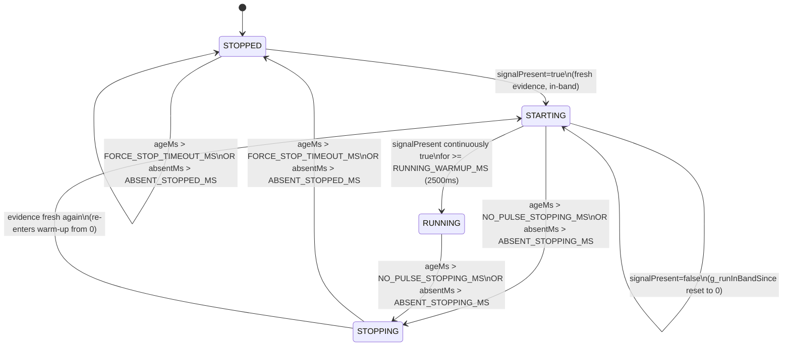

# Motor State Machine — WTVB02_ESP32S3_V16_CM_fault_latch_v3_hardened_patched_v16_5

**Source file:** `WTVB02_ESP32S3_V16_CM_fault_latch_v3_hardened_patched_v16_5.ino`
**Verification basis:** every code citation below quotes the file directly with a line number, current as of this documentation pass. Live-behavior claims in the Troubleshooting section are backed by an actual instrumented Serial Monitor capture taken during this investigation (methodology and raw evidence described in full).

**Related documents:** [ARCHITECTURE.md](ARCHITECTURE.md) · [TELEMETRY.md](TELEMETRY.md) · [FIRMWARE_CONFIG_AUDIT_v16.5.md](FIRMWARE_CONFIG_AUDIT_v16.5.md#motor-state-18-items)

## Table of Contents

- [Purpose](#purpose)
- [States](#states)
- [State Transition Diagram](#state-transition-diagram)
- [MotorStateEvidence Structure](#motorstateevidence-structure)
- [buildMotorStateEvidence()](#buildmotorstateevidence)
- [updateMotorStateMachine()](#updatemotorstatemachine)
- [processRPM()](#processrpm)
- [Evidence Source Modes](#evidence-source-modes)
  - [RPM Mode](#rpm-mode)
  - [Current Mode](#current-mode)
  - [Proximity Mode](#proximity-mode)
- [Every Timeout](#every-timeout)
- [Every Threshold](#every-threshold)
- [All Configuration Parameters](#all-configuration-parameters)
- [Troubleshooting: the July 2026 STARTING/STOPPING Flicker](#troubleshooting-the-july-2026-startingstopping-flicker)

---

## Purpose

The Motor State Machine derives one of four discrete run-states (`MOTOR_STOPPED`/`STARTING`/`RUNNING`/`STOPPING`) from whichever physical evidence source is compiled in (RPM pulse timing or CTR4A01 current draw). Every other subsystem in the firmware — analytics gating, alarm/health evaluation, telemetry field suppression, bearing-fault classification, the OLED display, and MQTT payload fields — reads this single `g_motorRunState` value (via `data->motor_state` in `VibrationData_t`) rather than re-deriving "is the motor running" itself. This centralization is deliberate: see `buildMotorStateEvidence()`'s own comment (line 2721) — *"decouples `updateMotorStateMachine()` from any specific sensor."*

[⬆ Back to top](#table-of-contents)

## States

Defined as `MotorRunState_t`, lines 1133-1138:

```cpp
typedef enum {
  MOTOR_STOPPED  = 0,   // ไม่มี / ไม่มี pulse
  MOTOR_STARTING = 1,   // กำลัง start (rpm ยังไม่เข้า rated band)
  MOTOR_RUNNING  = 2,   // RUNNING -- rpm อยู่ใน RATED_RPM +/- RATED_RPM_TOL
  MOTOR_STOPPING = 3    // กำลัง stop (pulse หายไปชั่วคราว)
} MotorRunState_t;
```

> **Verified documentation discrepancy:** these enum comments (and the `MotorStateSource` comment immediately below them, line 1141-1142: *"MOTOR_SRC_RPM is the only implemented path today; CURRENT and PROXIMITY are reserved for future commits and currently fall back to RPM values"*) are stale — they predate the Commit 3/4A/4B work that gave `MOTOR_SRC_CURRENT` a full, independent implementation (see [Current Mode](#current-mode)). Reproduced here verbatim rather than silently corrected, per this document's no-inference policy.

| State | Value | Meaning |
|---|---|---|
| `MOTOR_STOPPED` | 0 | No valid running evidence; the "resting" state. Initial value of `g_motorRunState` (line 2058). |
| `MOTOR_STARTING` | 1 | Evidence indicates the motor is active, but the required continuous in-band duration (`RUNNING_WARMUP_MS`) has not yet elapsed. |
| `MOTOR_RUNNING` | 2 | Evidence has been continuously present for at least `RUNNING_WARMUP_MS`. Gates almost every downstream feature (RMS/peak/CF/kurtosis reporting, analytics, alarm evaluation). |
| `MOTOR_STOPPING` | 3 | Evidence has gone stale or absent, but not yet long enough to declare full `MOTOR_STOPPED`. A transitional state. |

[⬆ Back to top](#table-of-contents)

## State Transition Diagram

Derived directly from `updateMotorStateMachine()` (lines 2790-2826):



**Critical implementation detail, verified from source (lines 2798-2804):** the STOPPED/STOPPING checks run *before* `signalPresent` is even consulted. `updateMotorStateMachine()` is a strict if/else-if/else chain:

```cpp
if (evidence.ageMs > FORCE_STOP_TIMEOUT_MS || absentMs > ABSENT_STOPPED_MS) {
    g_motorRunState  = MOTOR_STOPPED;
    g_runInBandSince = 0;
} else if (evidence.ageMs > NO_PULSE_STOPPING_MS || absentMs > ABSENT_STOPPING_MS) {
    g_motorRunState  = MOTOR_STOPPING;
    g_runInBandSince = 0;
} else {
    // only here is signalPresent actually used to decide STARTING vs RUNNING
}
```

This ordering is the exact mechanism behind the flicker documented in [Troubleshooting](#troubleshooting-the-july-2026-startingstopping-flicker) below: `ev.ageMs` can trip the STOPPING branch even while `signalPresent` is continuously `true`.

[⬆ Back to top](#table-of-contents)

## MotorStateEvidence Structure

Lines 1149-1160:

```cpp
// [Commit 3] Semantic evidence the state machine acts on -- decouples
// updateMotorStateMachine() from any specific sensor. Each source translates
// its own raw measurement into these two facts:
//   signalPresent -- does this source currently observe "motor active"
//                    conditions (RPM: in-band; Current: above threshold)?
//   ageMs         -- time since this source last had a fresh/valid reading.
// Deliberately minimal: no raw values, no thresholds, no source-specific
// config -- those stay entirely inside buildMotorStateEvidence().
struct MotorStateEvidence {
  bool     signalPresent;
  uint32_t ageMs;
};
```

Deliberately minimal by design (per its own comment): no raw sensor values, thresholds, or source identity ever leave `buildMotorStateEvidence()` — `updateMotorStateMachine()` is written to be entirely source-agnostic.

[⬆ Back to top](#table-of-contents)

## buildMotorStateEvidence()

Lines 2721-2765. Signature: `static MotorStateEvidence buildMotorStateEvidence(uint32_t timeSincePulseMs, float currentA)`. Dispatches on `g_motorStateSource` (an `enum MotorStateSource { MOTOR_SRC_RPM, MOTOR_SRC_CURRENT, MOTOR_SRC_PROXIMITY }`, lines 1143-1147), which is fixed at compile time — see [Every Configuration Parameter](#all-configuration-parameters) for exactly how.

```cpp
static MotorStateEvidence buildMotorStateEvidence(uint32_t timeSincePulseMs, float currentA) {
  MotorStateEvidence ev;
  switch (g_motorStateSource) {
    case MOTOR_SRC_CURRENT: {
      static const float kExpectedFullLoadA = MOTOR_NAMEPLATE_CURRENT_A * CT_TURNS *
                                               (CT_RATIO_SECONDARY_A / CT_RATIO_PRIMARY_A);
      static const float kThresholdA = kExpectedFullLoadA * (MOTOR_RUNNING_PERCENT / 100.0f);

      static float s_currentFiltered = 0.0f;
      s_currentFiltered = CURRENT_EMA_ALPHA * currentA + (1.0f - CURRENT_EMA_ALPHA) * s_currentFiltered;

      ev.signalPresent = (s_currentFiltered >= kThresholdA);
      ev.ageMs = millis() - g_lastCurrentSampleMs;
      // [Commit 4D diagnostic instrumentation -- see Troubleshooting section]
      break;
    }
    case MOTOR_SRC_PROXIMITY:
      // [placeholder] not implemented yet -- falls back to the RPM computation
      ev.signalPresent = (g_rpmFiltered >= (RATED_RPM - RATED_RPM_TOL)) &&
                         (g_rpmFiltered <= (RATED_RPM + RATED_RPM_TOL));
      ev.ageMs = timeSincePulseMs;
      break;
    case MOTOR_SRC_RPM:
    default:
      ev.signalPresent = (g_rpmFiltered >= (RATED_RPM - RATED_RPM_TOL)) &&
                         (g_rpmFiltered <= (RATED_RPM + RATED_RPM_TOL));
      ev.ageMs = timeSincePulseMs;
      break;
  }
  return ev;
}
```

Each branch is a self-contained translation of raw measurement → semantic evidence. `kExpectedFullLoadA`/`kThresholdA` are `static const` — computed once on first call, not every cycle. `s_currentFiltered` is a function-local `static float` — the EMA filter's persistent state, deliberately confined to this function (never a global) per the Commit 4A design comment (lines 2731-2733 in the current source).

As of this documentation pass, `buildMotorStateEvidence()` also contains **temporary diagnostic instrumentation** (`[Commit 4D]`, lines 2742-2748) added during the flicker investigation — see [Troubleshooting](#troubleshooting-the-july-2026-startingstopping-flicker).

[⬆ Back to top](#table-of-contents)

## updateMotorStateMachine()

Lines 2790-2826. Signature: `static void updateMotorStateMachine(const MotorStateEvidence& evidence)`. Consumes only the semantic `{signalPresent, ageMs}` pair — it has no knowledge of RPM, current, or any source-specific config, per its own header comment (lines 2767-2789).

```cpp
static void updateMotorStateMachine(const MotorStateEvidence& evidence) {
  if (evidence.signalPresent) {
    g_absentSince = 0;
  } else if (g_absentSince == 0) {
    g_absentSince = millis();
  }
  uint32_t absentMs = evidence.signalPresent ? 0 : (millis() - g_absentSince);

  if (evidence.ageMs > FORCE_STOP_TIMEOUT_MS || absentMs > ABSENT_STOPPED_MS) {
    g_motorRunState  = MOTOR_STOPPED;
    g_runInBandSince = 0;
  } else if (evidence.ageMs > NO_PULSE_STOPPING_MS || absentMs > ABSENT_STOPPING_MS) {
    g_motorRunState  = MOTOR_STOPPING;
    g_runInBandSince = 0;
  } else {
    if (evidence.signalPresent) {
      if (g_runInBandSince == 0) g_runInBandSince = millis();
      if ((millis() - g_runInBandSince) >= RUNNING_WARMUP_MS) {
        if (g_motorRunState != MOTOR_RUNNING) {
          Serial.printf("[MOTOR] Warm-up complete (in-band %.1fs) -> RUNNING\n",
                        RUNNING_WARMUP_MS / 1000.0f);
        }
        g_motorRunState = MOTOR_RUNNING;
      } else {
        g_motorRunState = MOTOR_STARTING;
      }
    } else {
      g_runInBandSince = 0;
      g_motorRunState  = MOTOR_STARTING;
    }
    if (g_prevMotorRunState == MOTOR_STOPPED) {
      g_bearingStableCnt = 0;
    }
  }
}
```

Two independent triggers can each force STOPPING/STOPPED (per the function's own header comment, lines 2777-2789): **(a)** evidence is *stale* (`ageMs` exceeds a timeout — "we don't currently know") or **(b)** evidence is *fresh but negative* (`signalPresent` has been continuously false for `absentMs` — "we know, and it says not-running"). For RPM these two conditions normally coincide; for the current-evidence path they can diverge, which is exactly what happened in the [flicker incident](#troubleshooting-the-july-2026-startingstopping-flicker).

[⬆ Back to top](#table-of-contents)

## processRPM()

Lines 2830-2926 (function continues past the excerpt below into peak-hold/thermal-resume logic not specific to the state machine itself). Runs every ~250ms from `taskStateMachine` (Core 0), called once per dequeued `VibrationData_t`.

```cpp
static void processRPM(VibrationData_t* data) {
  uint32_t interval, pulseCopy;
  noInterrupts();
  interval  = g_rpmPulseInterval;
  pulseCopy = g_rpmTotalPulses;
  interrupts();

  bool newPulse = (pulseCopy != g_rpmLastPulseCount);
  if (newPulse) g_rpmLastPulseMillis = millis();
  g_rpmLastPulseCount = pulseCopy;

  uint32_t timeSincePulseMs = millis() - g_rpmLastPulseMillis;

  // ---------- RPM Calculation (EMA filtered) ----------
  if (newPulse && interval >= RPM_MIN_INTERVAL_US) {
    float rpmRaw = (60000000.0f / interval) / PULSE_PER_REV;
    if (rpmRaw <= MAX_RPM * SPIKE_REJECT_FACTOR) {
      g_rpmFiltered = RPM_SMOOTH_ALPHA * rpmRaw
                    + (1.0f - RPM_SMOOTH_ALPHA) * g_rpmFiltered;
    }
  }

  // ---------- Motor State Machine ----------
  MotorStateEvidence evidence = buildMotorStateEvidence(timeSincePulseMs, data->current_a);
  updateMotorStateMachine(evidence);
  // [Commit 4D diagnostic print -- see Troubleshooting section]
```

Key behavior: `processRPM()` unconditionally computes the RPM EMA (`g_rpmFiltered`) from ISR-captured pulse timing *regardless* of which `g_motorStateSource` is active — RPM telemetry (the `rpm` field in every MQTT payload) is always live, even on a `MOTOR_SRC_CURRENT` build. It then calls `buildMotorStateEvidence()` with **both** `timeSincePulseMs` (RPM path input) and `data->current_a` (current path input) — the function itself decides which one to actually use based on `g_motorStateSource`. Later in the same function (not shown above, continues to line ~2940+), `g_motorRunState == MOTOR_STOPPED` forces `g_rpmFiltered = 0.0f`, and `MOTOR_STOPPING` decays it by 80% per cycle.

[⬆ Back to top](#table-of-contents)

## Evidence Source Modes

Selected via the `MotorStateSource` enum (lines 1143-1147) stored in `g_motorStateSource`, a single compile-time-fixed variable (see [All Configuration Parameters](#all-configuration-parameters) for exactly how it's set).

### RPM Mode

`MOTOR_SRC_RPM` (value 0, the default/fallback — `default:` case in the switch, lines 2757-2762). `signalPresent` = `g_rpmFiltered` within `[RATED_RPM - RATED_RPM_TOL, RATED_RPM + RATED_RPM_TOL]`. `ageMs` = `timeSincePulseMs`, i.e. wall-clock time since the last GPIO17 pulse was captured by the ISR. This is the production default: it is selected whenever the firmware is **not** compiled with `-DTEST_CURRENT_SOURCE`.

### Current Mode

`MOTOR_SRC_CURRENT` (value 1). `signalPresent` = EMA-filtered CTR4A01 current (`s_currentFiltered`) at or above `kThresholdA` (derived from `MOTOR_NAMEPLATE_CURRENT_A`, `CT_TURNS`, `CT_RATIO_SECONDARY_A`/`CT_RATIO_PRIMARY_A`, `MOTOR_RUNNING_PERCENT`). `ageMs` = time since `g_lastCurrentSampleMs` was last updated by a successful CTR4A01 Modbus read (`readCTR4A01Current()`, updated only on success). Only active when the firmware is compiled with `-DTEST_CURRENT_SOURCE` — a bench-test-only build flag per its own comment (lines 2062-2066): *"Undefined by default: production builds are unaffected, this branch does not exist in the translation unit at all."*

### Proximity Mode

`MOTOR_SRC_PROXIMITY` (value 2). Per the source's own comment (line 2751): **"[placeholder] not implemented yet -- falls back to the RPM computation."** Verified directly: the `MOTOR_SRC_PROXIMITY` case body (lines 2751-2756) is byte-for-byte identical to the `MOTOR_SRC_RPM` case — same `g_rpmFiltered`-in-band check, same `timeSincePulseMs` for `ageMs`. There is no separate proximity-sensor evidence path in the current source; this mode exists in the enum for a future commit but has no distinct behavior today.

[⬆ Back to top](#table-of-contents)

## Every Timeout

All four timing constants, exactly as they gate `updateMotorStateMachine()`:

| Constant | Value | Line | Governs |
|---|---|---|---|
| `NO_PULSE_STOPPING_MS` | 400 ms | 201 | `ageMs > NO_PULSE_STOPPING_MS` → force `MOTOR_STOPPING`, reset warm-up timer |
| `FORCE_STOP_TIMEOUT_MS` | 2000 ms | 202 | `ageMs > FORCE_STOP_TIMEOUT_MS` → force `MOTOR_STOPPED`, reset warm-up timer |
| `ABSENT_STOPPING_MS` | 15000 ms | 214 | `absentMs > ABSENT_STOPPING_MS` (signalPresent continuously false, but evidence fresh) → force `MOTOR_STOPPING` |
| `ABSENT_STOPPED_MS` | 30000 ms | 215 | `absentMs > ABSENT_STOPPED_MS` → force `MOTOR_STOPPED` |
| `RUNNING_WARMUP_MS` | 2500 ms | 204 | Minimum continuous `signalPresent=true` duration before `MOTOR_STARTING` promotes to `MOTOR_RUNNING` |
| `FAULT_WINDOW_MS` | 3000 ms | 203 | RUNNING but no pulse for >3s → `prox=0` (Fault) reported in telemetry (separate from the state machine itself — used at line 2930, in the peak-hold/fault-flag logic that follows `processRPM()`'s state-machine call) |

**Structural relationship that caused the flicker (see [Troubleshooting](#troubleshooting-the-july-2026-startingstopping-flicker)):** `NO_PULSE_STOPPING_MS` (400ms) is *smaller* than `CURRENT_SAMPLE_INTERVAL_MS` (500ms, the CTR4A01 sensor's own acquisition cadence — see [TELEMETRY.md](TELEMETRY.md) / [ARCHITECTURE.md](ARCHITECTURE.md)). For the RPM path this constant was originally tuned against sub-100ms pulse timing at rated speed, where it's a comfortable margin; for the current path, whose natural staleness floor is the 500ms sensor cadence itself, 400ms is *tighter than the sampling interval it's measuring against*.

[⬆ Back to top](#table-of-contents)

## Every Threshold

| Constant | Value | Line | Governs |
|---|---|---|---|
| `RATED_RPM` | `NAMEPLATE_RPM` (1800) | 197 | Center of the RPM in-band window (RPM mode + Proximity mode) |
| `RATED_RPM_TOL` | 75 | 198 | ± tolerance around `RATED_RPM` defining the in-band window (1725–1875 RPM) |
| `MOTOR_NAMEPLATE_CURRENT_A` | 1.0 A (placeholder) | 1609 | Motor full-load amps reference for the current threshold calculation |
| `CT_RATIO_PRIMARY_A` | 1.0 | 1610 | CT clamp ratio primary side (1:1 = no external clamp) |
| `CT_RATIO_SECONDARY_A` | 1.0 | 1611 | CT clamp ratio secondary side |
| `CT_TURNS` | 1 | 1612 | CT clamp turns multiplier |
| `MOTOR_RUNNING_PERCENT` | 20.0 % | 1613 | Fraction of `kExpectedFullLoadA` used as the running-current threshold |
| `CURRENT_EMA_ALPHA` | 0.25 | 1623 | EMA smoothing coefficient applied to the raw CTR4A01 reading before threshold comparison |

Derived at runtime (not independently configurable, computed from the above): `kExpectedFullLoadA = MOTOR_NAMEPLATE_CURRENT_A × CT_TURNS × (CT_RATIO_SECONDARY_A / CT_RATIO_PRIMARY_A)` = 1.0 A with current defaults; `kThresholdA = kExpectedFullLoadA × (MOTOR_RUNNING_PERCENT / 100)` = **0.2 A** with current defaults.

[⬆ Back to top](#table-of-contents)

## All Configuration Parameters

Every constant that affects the Motor State decision, cross-referenced to the full audit:

| Constant | Value | Line | Category |
|---|---|---|---|
| `TEST_CURRENT_SOURCE` | build flag, undefined by default | N/A (compiler `-D` flag) | Source selector |
| `NAMEPLATE_RPM` | 1800 | 190 | RPM threshold input |
| `RATED_RPM` | `NAMEPLATE_RPM` | 197 | RPM threshold |
| `RATED_RPM_TOL` | 75 | 198 | RPM threshold |
| `NO_PULSE_STOPPING_MS` | 400 | 201 | Timeout |
| `FORCE_STOP_TIMEOUT_MS` | 2000 | 202 | Timeout |
| `FAULT_WINDOW_MS` | 3000 | 203 | Timeout (fault flag, not state machine itself) |
| `RUNNING_WARMUP_MS` | 2500 | 204 | Timeout |
| `ABSENT_STOPPING_MS` | 15000 | 214 | Timeout |
| `ABSENT_STOPPED_MS` | 30000 | 215 | Timeout |
| `STOPPED_CLEAR_MS` | 1,800,000 (30 min) | 216 | **Confirmed unused** — see [FIRMWARE_CONFIG_AUDIT_v16.5.md](FIRMWARE_CONFIG_AUDIT_v16.5.md#appendix-unused-constants-13-confirmed-zero-other-references) |
| `COLD_START_TEMP_DROP_C` | 5.0 °C | 217 | Resume/clear policy (not the state machine decision itself) |
| `MOTOR_NAMEPLATE_CURRENT_A` | 1.0 A | 1609 | Current threshold input |
| `CT_RATIO_PRIMARY_A` | 1.0 | 1610 | Current threshold input |
| `CT_RATIO_SECONDARY_A` | 1.0 | 1611 | Current threshold input |
| `CT_TURNS` | 1 | 1612 | Current threshold input |
| `MOTOR_RUNNING_PERCENT` | 20.0 % | 1613 | Current threshold |
| `CURRENT_EMA_ALPHA` | 0.25 | 1623 | Current filter |
| `CURRENT_SAMPLE_INTERVAL_MS` | 500 | 1600 | CTR4A01 sample cadence — indirectly sets the current-evidence `ageMs` floor |

Full audit entry for each (default, every reference line, unused status) is in [FIRMWARE_CONFIG_AUDIT_v16.5.md § Motor State](FIRMWARE_CONFIG_AUDIT_v16.5.md#motor-state-18-items).

[⬆ Back to top](#table-of-contents)

## Troubleshooting: the July 2026 STARTING/STOPPING Flicker

### Symptom

On a live bench unit, after a normal `MOTOR_STOPPED → MOTOR_RUNNING` transition, the state machine would spontaneously drop out of `MOTOR_RUNNING` and oscillate between `MOTOR_STARTING` and `MOTOR_STOPPING` continuously — sometimes for minutes — **while the motor was physically running and drawing normal current the entire time.**

### Verification methodology

This was not diagnosed from static code reading alone — it was root-caused in three escalating steps, each one verified against live hardware before proceeding to the next:

1. **Firmware identity confirmation.** Before trusting any live behavior, the actual build running on the bench unit had to be confirmed, since `build.options.json` on disk cannot prove what's actually flashed on a given board. A boot-time identity banner (`[Commit 4C]`, in `setup()`) was added, printing `TEST_CURRENT_SOURCE`, `g_motorStateSource`, and the four key timing/threshold constants directly to the Serial Monitor on every cold boot. A clean build + flash + Serial Monitor capture confirmed: `TEST_CURRENT_SOURCE: YES`, `g_motorStateSource: MOTOR_SRC_CURRENT` — i.e. the current-evidence path genuinely was the one gating this board's behavior, not a stale/different build.

2. **Live current-vs-state correlation.** A ~15-30 minute Serial Monitor capture (raw `[CURRENT] raw=` mA readings + `[MOTOR]`/`bear=` state transitions) was recorded while the motor was manually stopped and restarted. Statistical comparison of two multi-minute windows — one during confirmed `RUNNING` (843 samples, mean 1493 mA) and one during an anomalous sustained `STOPPED` report (842 samples, mean 1491 mA) — showed the current distribution was **statistically indistinguishable** between the two, proving the motor was mechanically running throughout the "STOPPED" period. A second, sharper instance was captured directly: `[MOTOR] STOPPED transition` fired at a timestamp where `[CURRENT] raw=` was 1665→1718 mA — rising through its highest values of the session at the exact moment STOPPED was declared.

3. **Per-cycle instrumentation of the evidence path itself.** To isolate *which half* of `buildMotorStateEvidence()`'s CURRENT branch was responsible — the threshold comparison (`kThresholdA`) or the timeout logic (`NO_PULSE_STOPPING_MS`/`ageMs`) — temporary diagnostic prints (`[Commit 4D]`, still present in the source as of this documentation pass, tagged for removal) were added at both the evidence-build site and the state-machine-consume site:
   - In `buildMotorStateEvidence()` (lines 2742-2748): prints `filtered`, `thresh`, `signalPresent`, `ageMs` on every evaluation.
   - In `processRPM()` (lines 2855-2859): prints the resulting `motorState` immediately after `updateMotorStateMachine()` runs on that same evidence.

   A rebuilt, reflashed, and freshly captured Serial Monitor log caught **4 independent STOPPING transitions**, each showing the identical pattern:

   | Event | filtered (A) | thresh (A) | signalPresent | ageMs at trip | Result |
   |---|---|---|---|---|---|
   | #1 | 1.368 | 0.200 | **1 (true)** | **469** | → `MOTOR_STOPPING` |
   | #2 | 1.469 | 0.200 | **1 (true)** | **445** | → `MOTOR_STOPPING` |
   | #3 | 1.228 | 0.200 | **1 (true)** | **473** | → `MOTOR_STOPPING` |
   | #4 | 1.293 | 0.200 | **1 (true)** | **448** | → `MOTOR_STOPPING` |

   `signalPresent` was `true` in every single captured cycle around every transition — current stayed 6-7× above threshold throughout. `ageMs` crossed from ~200-225ms to 445-473ms in one 250ms cycle each time, tripping `NO_PULSE_STOPPING_MS` (400) purely on staleness. Each STOPPING event also unconditionally zeroed `g_runInBandSince` (line 2803), forcing a fresh 2500ms `RUNNING_WARMUP_MS` re-climb through `MOTOR_STARTING` even though current never wavered — matching the observed pattern of RUNNING streaks (51–278 cycles) each followed by exactly one STOPPING cycle then exactly 10 STARTING cycles (2500ms ÷ 250ms).

### Confirmed root cause

`NO_PULSE_STOPPING_MS` (400ms) is smaller than `CURRENT_SAMPLE_INTERVAL_MS` (500ms) — the CTR4A01's own acquisition cadence. `evidence.ageMs` for the CURRENT source is mathematically guaranteed to exceed 400ms during part of *every* refresh cycle, independent of jitter, independent of how far above threshold the actual current sits. `updateMotorStateMachine()` checks `ageMs` staleness **before** consulting `signalPresent` at all (see [State Transition Diagram](#state-transition-diagram)), so this timing artifact alone is sufficient to force `MOTOR_STOPPING`, and its unconditional `g_runInBandSince = 0` prevents `MOTOR_RUNNING` from ever being sustained. This is a timing-constant defect, not a threshold-calculation defect: `kThresholdA` (0.2 A) and the EMA filter were independently confirmed correct — `signalPresent` never went false during any captured flicker event.

### Recommended fix — **not yet applied to source**

The following values were derived from the live data above and documented in the investigation's calibration report, but **as of this documentation pass, the source still contains the original `400`/`2000` values** (verified: `FIRMWARE_CONFIG_AUDIT_v16.5.md` shows `NO_PULSE_STOPPING_MS = 400` at line 201, `FORCE_STOP_TIMEOUT_MS = 2000` at line 202, unchanged). No threshold or timeout edit has been applied — this section documents the analysis and recommendation only, pending explicit approval:

| Parameter | Current | Recommended | Rationale |
|---|---|---|---|
| `NO_PULSE_STOPPING_MS` | 400 | 1200 | Must exceed `CURRENT_SAMPLE_INTERVAL_MS` (500) with margin for one delayed/retried CT sample (bus shared with WTVB02 polling) without falsely tripping STOPPING mid-warm-up. 1200 = 2.4× nominal cadence. |
| `FORCE_STOP_TIMEOUT_MS` | 2000 | 2500 | One extra sample-period of headroom above the raised `NO_PULSE_STOPPING_MS`, so a single retried CT transaction doesn't cascade into a forced `MOTOR_STOPPED`. |

The `[Commit 4D]` diagnostic instrumentation (the `[CUR-DEBUG]` print lines in `buildMotorStateEvidence()` and `processRPM()`) is also still present in the source, explicitly tagged for removal once the fix is applied and re-verified.

[⬆ Back to top](#table-of-contents)

---

*This document describes firmware behavior as of the source state at documentation time. No source code was modified to produce it.*
